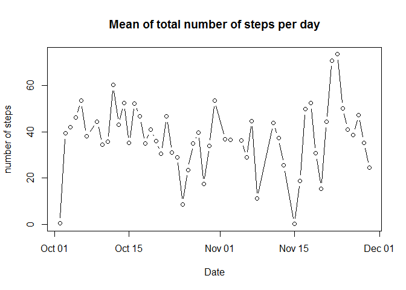
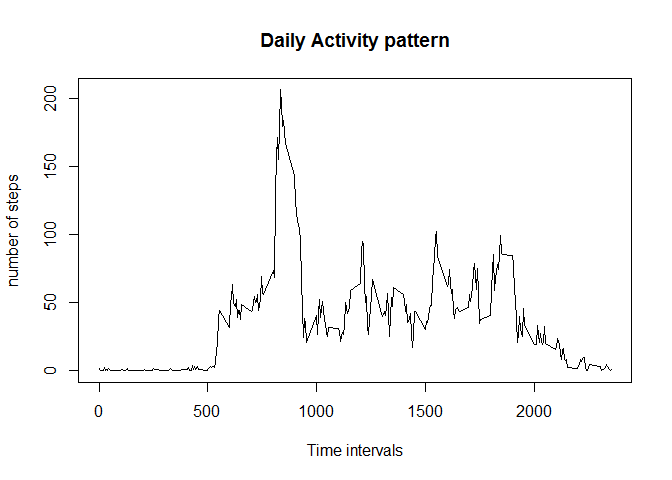
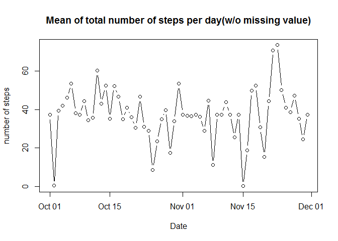
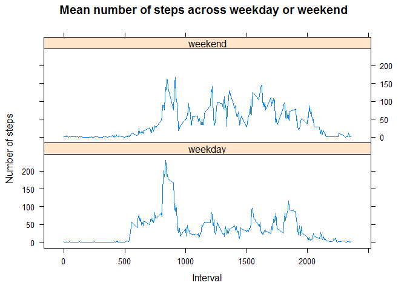

# Reproducible Research: Peer Assessment 1


## Loading and preprocessing the data


```r
activity <- read.csv("activity.csv", header = TRUE, sep=",")
activity$date <- as.Date(activity$date, format="%Y-%m-%d")
activityClean <- activity[which(activity$steps != "NA"),]
```


## What is mean total number of steps taken per day?

```r
activtyFrame <- as.data.frame(activityClean)
subsetAc <- subset(activtyFrame, select = c(steps,date))
activityMean <- aggregate(subsetAc$steps,by=list(subsetAc$date),mean)
names(activityMean) <- c("date","steps") 

with(activityMean, plot(activityMean$date,activityMean$steps,type="b", xlab="Date", ylab="number of steps", main="Mean of total number of steps per day"))
```

 

The mean of total number of steps per day is

```r
meanSteps <- mean(activityMean$steps)
meanSteps
```

```
## [1] 37.3826
```

The median of total number of steps per day is

```r
medianSteps <- median(activityMean$steps)
medianSteps
```

```
## [1] 37.37847
```


## What is the average daily activity pattern?

```r
subsetInt <- subset(activtyFrame, select = c(steps,interval))
activityInterval <- aggregate(subsetInt$steps,by=list(subsetInt$interval),mean)
names(activityInterval) <- c("interval","steps") 

with(activityInterval, plot(activityInterval$interval,activityInterval$steps,type="l", xlab="Time intervals", ylab="number of steps", main="Daily Activity pattern"))
```

 

the time interval which has the maximum number of steps:


```r
activityInterval[which.max(activityInterval$steps),]
```

```
##     interval    steps
## 104      835 206.1698
```


## Imputing missing values

Total number of missing values in the dataset:

```r
activityNA <- activity[which(is.na(activity$steps)),]
length(activityNA$steps)
```

```
## [1] 2304
```

The missing values are filled in by the mean of the 5 minute interval


```r
totalRow <- nrow(activity)
newActivity <- activity

for(i in 1:totalRow)
  {
    if(is.na(newActivity$steps[i]))
       {
        newActivity$steps[i] <- activityInterval$steps[which(activityInterval$interval == newActivity$interval[i])]
      
       }
  
  }
```

The following is the histogram based on the new dataset:


```r
subsetAc2 <- subset(newActivity, select = c(steps,date))
activityMean2 <- aggregate(subsetAc2$steps,by=list(subsetAc2$date),mean)
names(activityMean2) <- c("date","steps") 

with(activityMean2, plot(activityMean2$date,activityMean2$steps,type="b", xlab="Date", ylab="number of steps", main="Mean of total number of steps per day(w/o missing value)"))
```

 

The new mean of total number of steps per day is

```r
meanSteps2 <- mean(activityMean2$steps)
meanSteps2
```

```
## [1] 37.3826
```

The new median of total number of steps per day is

```r
medianSteps2 <- median(activityMean2$steps)
medianSteps2
```

```
## [1] 37.3826
```

There is no differences with the mean, but only a slight difference in the median of the number of steps per day.


## Are there differences in activity patterns between weekdays and weekends?


```r
activityWeek <- newActivity
activityWeek$day<- factor(weekdays(activityWeek$date))
levels(activityWeek$day) <- list(weekday = c("Monday", "Tuesday", "Wednesday", 
                                               "Thursday", "Friday"),
                                   weekend = c("Saturday", "Sunday"))
```


```r
library(lattice)
meanSteps3 <- aggregate(activityWeek$steps, list(as.numeric(activityWeek$interval),activityWeek$day), mean)
names(meanSteps3) <- c("interval","day", "steps")


xyplot(meanSteps3$steps ~ meanSteps3$interval | meanSteps3$day, 
       layout = c(1, 2), type = "l", 
       xlab = "Interval", ylab = "Number of steps", main="Mean number of steps across weekday or weekend")
```

 

There is a slight difference between weekdays and weekends.
